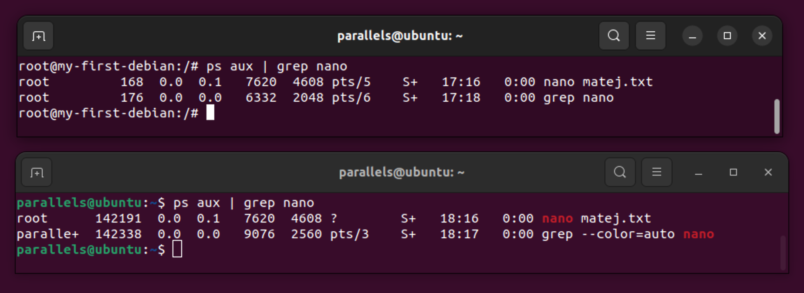

# Introduction to Linux Containers

Sources:
- ✅ [LXD vs Docker](https://ubuntu.com/blog/lxd-vs-docker)
- ✅ [What's a Linux container?](https://www.redhat.com/en/topics/containers/whats-a-linux-container)
- ✅ [What are Linux containers?](https://ubuntu.com/blog/what-are-linux-containers)

--- 

Nowadays, deploying applications inside some sort of a Linux container is a widely adopted practice, primarily due to the evolution of the tooling and the ease of use it presents.


## Containerization vs traditional virtualization
Virtualization was developed as an effort to **fully utilize available computing resources**. Virtualization enables multiple virtual machines to run on a single host for different purposes with their own isolated space. 

Virtualization achieved such isolated operating system environments using hypervisors, computer software that sits in between the host operating system and the guest or the virtual machine’s operating system.

Containerization differs from traditional virtualization technologies and offers many advantages over traditional virtualization:
- Containers are **lightweight** compared to traditional virtual machines.
- Unlike containers, virtual machines require emulation layers (either software or hardware), which consume more resources and add additional overhead.
- Containers share resources with the underlying host machine, with user space and process isolations.
- Due to the lightweight nature of containers, more containers can be run per host than virtual machines per host.
- Starting a container happens nearly instantly compared to the slower boot process of virtual machines.
- Containers are portable and can reliably regenerate a system environment with required software packages, irrespective of the underlying host operating system.


## Introduction to Linux Containers
Containerization is the next logical step in virtualization, and there is a huge buzz around this technology. Containers can **provide virtualization at both the operating system level and the application level.**

Some of the possibilities with containers are as follows:
- Provide a complete operating system environment that is sandboxed (isolated)
- Allow packaging and isolation of applications with their entire runtime environment
- Provide a portable and lightweight environment
- Help to maximize resource utilization in data centers
- Aid different development, test, and production deployment workflows


## Container Definition
A **container can be defined as a single operating system image, bundling a set of isolated applications and their dependent resources so that they run separated from the host machine.** There may be multiple such containers running within the same host machine.

Containers can be classified into two types:
- **Operating system level**: An entire operating system runs in an isolated space within the host machine, sharing the same kernel as the host machine.
- **Application level**: An application or service, and the minimal processes required by that application, runs in an isolated space within the host machine.


## What types of containers are there?
- **System containers** (as run by LXD) are similar to virtual or physical machines. They **run a full operating system inside them**, you can run any type of workload, and you manage them exactly as you would a virtual or a physical machine. System containers are usually **long-lasting** and you could host **several applications** within a single system container. That means you can install packages inside them, you can manage services, define backup policies, monitoring, and all other aspects as you usually would with a virtual machine.
- **Application containers** (such as Docker), also known as process containers, are containers that **package and run a single process or a service** per container. They run **stateless types of workloads** that are meant to be ephemeral. This means that these containers are temporary, and you can create, delete and replace containers easily as needed. Usually, you don’t need to care about the lifecycle of those containers.

> A common confusion for potential users of LXD is that LXD is an alternative to Docker or Kubernetes. However, LXD and Docker are not competing container technologies, and they tend to serve completely different purposes.


<!-- Source: https://ubuntu.com/blog/lxd-vs-docker -->

Both application and system containers share a kernel with the host operating system and utilize it to create isolated processes.
- Application containers run a single app/process.
- System containers run a full operating system giving them flexibility for the workload types they support.


## Container History
Container technology has existed for a long time in different forms, but it has significantly gained popularity recently in the Linux world with the introduction of native containerization support in the Linux kernel. System containers are technically the oldest type of containers. 
- 1982: Chroot (Unix-like operating systems)
- 1999: **BSD introduced jails**, a way of running a second BSD system on the same kernel as the main system.
- 2001: Linux implementation of the concept through Linux **vServer**. This was a separate project with a big patch set towards Linux kernel aimed at implementing a functionality similar to BSD jails.
- 2004: Solaris (Sun Solaris, Open Solaris) grew Zones which was the same concept but a part of Solaris OS.
- 2005: OpenVZ project started to implement multiple VPSs (virtual private servers) on Linux.
- 2008: LXC (Linux)
- 2013: Docker (Linux, FreeBSD, Windows)


## LXC and linuxcontainers.org

Linux containers, also known as LXC, was the first implementation of system containers that was entirely based on mainline Linux features. This means that you could take a completely clean upstream kernel, or the kernel as distributed by any Linux distribution, and use that to create containers on Linux. LXC itself is a low-level tool that can create both system containers and application containers.
- LXC containers are often considered as something in the middle between a chroot and a full-fledged virtual machine.
- The goal of LXC is to create an environment as close as possible to a standard Linux installation but without the need for a separate kernel.
- LXC containers are essentially a copy of an operating system running on the same kernel as its host, so in this case, you don’t virtualise anything, and there are no overhead processes.

**[linuxcontainers.org](https://linuxcontainers.org/) is the umbrella project** behind Incus, LXC, LXCFS, Distrobuilder and more.

The goal is to offer a **distro and vendor neutral environment** for the development of Linux container technologies. The focus is providing containers and virtual machines that run full Linux systems. While VMs supply a complete environment, system containers offer an environment as close as possible to the one you'd get from a VM, but without the overhead that comes with running a separate kernel and simulating all the hardware.

**When should you use Linux containers?**
- Anytime when you’re running Linux on Linux, you should be considering using containers instead of virtual machines.
- For almost any use case, you could run the exact same workload in a system container and not get any of the overhead that you usually get when using virtual machines.
- The only exception would be if you needed a specific version of the kernel different from the kernel of the host, for a specific feature of that virtual machine.
- System containers are much easier to manage than virtual machines.


## What is LXD?
**LXD is a system container and a virtual machine manager** that runs on top of LXC, enhancing the experience and enabling **easier control** and maintenance. LXD is image-based and provides images for a wide number of different Linux distributions. A simple command-line tool enables you to easily manage your instances, and it is easy to integrate it with third-party orchestration and management tools. LXD can run **clusters**, it provides support for different storage backends and network types and scales easily from one instance on your laptop to a full rack in a data center.

LXC:
- Linux container runtime allowing creation of multiple isolated Linux systems (containers) on a control host using a single Linux kernel
- Only supports containers
- Low-level tool requiring expertise

LXD:
- System container and virtual machine manager built on top of LXC, enabling easier management, control and integration
- Supports container and VMs
- Better user experience through a simple REST API


## Docker vs Linux Containers
- ✅ [Linux Containers vs Docker - What is the Difference](https://www.section.io/engineering-education/lxc-vs-docker-what-is-the-difference-and-why-docker-is-better/)
- ✅ [Unveiling the Differences: LXC vs Docker – An In-Depth Comparison](https://www.redswitches.com/blog/lxc-vs-docker/)
- ✅ [LXD vs Docker](https://ubuntu.com/blog/lxd-vs-docker)
- ✅ [LXC vs Docker: Why Docker is Better in 2023](https://www.upguard.com/blog/docker-vs-lxc)
- ✅ [LXC vs Docker: Which Container Platform Is Right for You?](https://earthly.dev/blog/lxc-vs-docker/)

> Up to version 0.8, Docker was essentially based on LXC.

- **Host-Machine Utilization**:
    - Docker: utilizes application-level virtualization
    - LXC: provides a lightweight OS-level virtualization, making LXC more efficient in resource utilization
- **Simplicity**:
    - Docker shines in simplicity and flexibility in design and usage. Its user-friendly interface and irregular approach through Dockerfiles make it easy for developers to create and manage containers.
    - LXC is a low-level tool that requires expertise in Linux administration and containerization. It is not as user-friendly as Docker.
- **Tooling**:
    - Docker offers a rich set of commands and tools for managing containers, making it highly versatile for various use cases.
    - LXC, while functional, may need more of the user-friendly tooling.
- **Use Cases**:
    - Docker Use Cases: Microservices Architecture, Continuous Integration and Continuous Deployment (CI/CD), DevOps Environments
    - LXC Use Cases: Heavy Resource Utilization Applications, Virtual Desktop Infrastructure (VDI),  System-Level Testing


## Features to Enable Containers
Containers rely on the following core features of the Linux kernel to form a contained or isolated environment within the host machine. This area is similar to a virtual machine, but operates with the need for a hypervisor (no virtualization or emulation of hardware resources). Instead the resources are shared with containers in a controlled manner.

- **Control groups (cgroups)**
    - "resource management"
- **Namespaces (ns)**
    - "resource isolation"
- **Filesystem (rootfs)**
    - "guest system rootfs"

Due to the flexibility of of such system design, containers (LXC) also support direct **hardware device passthrough** to guest systems. This is especially important for applications requiring low-level access to PCI devices, such as GPUs and NICs, as well as for USB devices etc.

### Control Groups (cgroups)

`cgroups`, short for control groups, is a feature of the Linux kernel that allows you to allocate, prioritize, deny, manage, and monitor system resources like CPU time, system memory, network bandwidth (using cgroup networking extensions), or combinations of these resources for a group of processes running on a system. It's a powerful tool for **resource management** and is widely used in various scenarios, especially in containerization and virtualization. 

You can group processes into cgroups based on various criteria like user, service, or task. This grouping mechanism can isolate these processes from others, making it useful for system stability and security. In virtualization and containerization (like Docker and LXC), cgroups provide a way to isolate and limit resources used by containers, ensuring that they don’t monopolize system resources. They help in managing and optimizing the performance of applications by controlling the allocation of resources.

> Brief implementation history:
> - Google presented a new generic method to solve the resource control problem with the cgroups project in 2007.
> - The mainline Linux kernel first included a cgroups implementation in 2008, and this paved the way for LXC.

**Types of Resources Controlled by cgroups:**

- CPU: Limiting CPU usage, setting CPU priorities.
- Memory: Limiting memory usage, managing out-of-memory priorities.
- Block I/O: Limiting access to I/O devices, prioritizing I/O access.
- Network: Although traditionally not part of cgroups, there are extensions and tools that integrate network bandwidth management into the cgroups framework.

**Operation Principles:**

Cgroups provide a mechanism to aggregate sets of tasks or processes and their future children into hierarchical groups. These groups may be configured to have specialized behavior as desired. Under the hood cgroups make use of various kernel features to manage resources, e.g.:

- For CPU resources, cgroups integrate with the Linux scheduler to allocate CPU time among different groups according to configured limits and priorities.
- For memory, cgroups interact with the kernel's memory manager to track and limit the memory usage of processes in a group.

**Interacting with cgroups:**

As a part of the Linux kernel, cgroups require no additional software to work on a Linux system (interaction is possible using the filsystem interface, by manipulating files in `/sys/fs/cgroup/`), though userland tools are used to interact with them. For cgroups v2 the `cgroup-tools` (a.k.a `libcgroup` or `cgutils`) is one of the recommended packages.

The `cgroup-tools` package provides several management utilities, including:
- `cgcreate`: This tool is used to create a new control group using the desired subsystems.
- `cgset`: This tool is used to set resource limits on a control group. 
- `cgclassify`: This tool is used to move running processes into a control group.
- `cgexec`: This tool is used to start a process directly in a specified control group.
- `cgget`: This tool displays the parameters and their values for a specified control group.
- `cgdelete`: This tool is used to remove a control group.

**Example:** creating a new cgroup, setting its resource limits and migrating a running process
```bash
sudo cgcreate -g cpu,memory:/mygroup # subsystems and name
sudo cgset -r memory.max=500M mygroup # memory limit
sudo cgclassify -g cpu,memory:/mygroup 1234 # PID
```

You may also interact with cgroups directly on the filesystem. Following a key design philosophy in UNIX, where "everything is a file", cgroups are listed within the pseudo-filesystem subsystem in the directory `/sys/fs/cgroup`, which gives an overview of all the cgroup subsystems available or mounted in the currently running system:

```bash
ls -lh /sys/fs/cgroup
```

```bash
-r--r--r--  1 root root 0 Dec 12 16:38 cgroup.controllers
-rw-r--r--  1 root root 0 Dec 12 16:38 cgroup.max.depth
-rw-r--r--  1 root root 0 Dec 12 16:38 cgroup.max.descendants
-rw-r--r--  1 root root 0 Dec 12 16:38 cgroup.pressure
-rw-r--r--  1 root root 0 Dec 12 16:38 cgroup.procs
-r--r--r--  1 root root 0 Dec 12 16:38 cgroup.stat
-rw-r--r--  1 root root 0 Dec 12 16:38 cgroup.subtree_control
-rw-r--r--  1 root root 0 Dec 12 16:38 cgroup.threads
-rw-r--r--  1 root root 0 Dec 12 16:38 cpu.pressure
-r--r--r--  1 root root 0 Dec 12 16:38 cpuset.cpus.effective
-r--r--r--  1 root root 0 Dec 12 16:38 cpuset.mems.effective
-r--r--r--  1 root root 0 Dec 12 16:38 cpu.stat
drwxr-xr-x  2 root root 0 Dec 13 15:08 dev-hugepages.mount
drwxr-xr-x  2 root root 0 Dec 13 15:08 dev-mqueue.mount
drwxr-xr-x  2 root root 0 Dec 12 16:38 init.scope
-rw-r--r--  1 root root 0 Dec 12 16:38 io.cost.model
-rw-r--r--  1 root root 0 Dec 12 16:38 io.cost.qos
-rw-r--r--  1 root root 0 Dec 12 16:38 io.pressure
-rw-r--r--  1 root root 0 Dec 12 16:38 io.prio.class
-r--r--r--  1 root root 0 Dec 12 16:38 io.stat
-r--r--r--  1 root root 0 Dec 12 16:38 memory.numa_stat
-rw-r--r--  1 root root 0 Dec 12 16:38 memory.pressure
--w-------  1 root root 0 Dec 12 16:38 memory.reclaim
-r--r--r--  1 root root 0 Dec 12 16:38 memory.stat
-r--r--r--  1 root root 0 Dec 12 16:38 misc.capacity
drwxr-xr-x  2 root root 0 Dec 13 15:08 mygroup # note our new group here
drwxr-xr-x  2 root root 0 Dec 13 15:08 proc-sys-fs-binfmt_misc.mount
drwxr-xr-x  2 root root 0 Dec 13 15:08 sys-fs-fuse-connections.mount
drwxr-xr-x  2 root root 0 Dec 13 15:08 sys-kernel-config.mount
drwxr-xr-x  2 root root 0 Dec 13 15:08 sys-kernel-debug.mount
drwxr-xr-x  2 root root 0 Dec 13 15:08 sys-kernel-tracing.mount
drwxr-xr-x 57 root root 0 Dec 13 15:18 system.slice
drwxr-xr-x  3 root root 0 Dec 13 15:08 user.slice
```

The control groups are organized hierarchically, meaning that each cgroup inherits properties from its parent, and resources can be managed at different levels.

> Note: you output may differ depending on cgroup configuration. Moreover, cgroup v1 uses a different directory structure than cgroup v2. You can check for cgroup version using the `mount | grep cgroup` command. If cgroup sys is not mounted, but is supported by your kernel you may mount the fs using `mount -t cgroup2 none /sys/fs/cgroup`.

We can now view or modify maximum allowed cgroup memory using standard file operations:

```bash
# get max memory
cat /sys/fs/cgroup/mygroup/memory.max # result in bytes
# add PID 1234 to group
echo 1234 >> /sys/fs/cgroup/mygroup/cgroup.procs
```

Note that these changes are not persistent! For persistent configuration, you would typically use a boot-time script or a daemon like systemd.

> Aside: Linux monitors changes in the cgroup filesystem through the `inotify` Linux kernel subsystem that provides a means to monitor filesystem events.

### Namespaces

Linux namespaces are a feature of the Linux kernel that provide **resource and process isolation**. They allow for the partitioning of various aspects of the operating system, so that each set of processes sees its own isolated instance of the global resource. This is one of the key technologies that enable containerization in Linux.

Namespaces provide an abstraction of global system resources that will appear to the processes within the defined namespaces as their own isolated instances of a specific global resources. They enable a form of "lightweight process virtualization", ensuring that processes in different namespaces cannot see or affect each other. This is fundamental for the security and stability of Linux containers; they provide the required isolation between a container and the host system, as well as between containers themselves.

> Brief implementation history:
> - At the Ottawa Linux Symposium held in 2006, Eric W. Bierderman presented his paper “Multiple Instances of the Global Linux Namespaces”
> - This paper proposed the addition of ten namespaces to the Linux kernel. His inspiration for these additional namespaces was the existing filesystem namespace for mounts, which was introduced in 2002.

**Namespace Types**

Over time, different namespaces have been implemented in the Linux kernel:
- Mount: `CLONE_NEWNS`- Mount points
- Network: `CLONE_NEWNET` - Network devices, stacks, firewall, routing tables, etc.
- User: `CLONE_NEWUSER` - User and group IDs
- PID: `CLONE_NEWPID`- Process IDs
- UTS: `CLONE_NEWUTS` - Hostname and NIS domain name
- IPC: `CLONE_NEWIPC` - System V IPC, POSIX message queues
- Cgroup: `CLONE_NEWCGROUP` - Cgroup root directory

Example: The image below demonstrates the effect of PID namespace by comparing process IDs of the same process as seen from the container (top) and from the host system (bottom). Because `nano` runs in the container, the container assigns it a PID in its own namespace (168). However, the host system keeps track of the sam process in a global namespace, assigning it a different PID (142191).



**Interfacing with Namespaces**

Creating a new namespace in Linux can be done using either command-line tools or system calls in a C program. Given is the example of creating a new **network namespace**.

We can use the `ip` command from the `iproute2` package to manage network namespaces. Here's how to create and use a new network namespace:

```bash
sudo ip netns add mynetns # add a network namespace
```

In order to connect the new isolated network namespace to the host (e.g, to enable internet connectivity) we have to create a **virtual ethernet (veth) interface pair (virtual cable)**. We can use the veth interface pair as a crossover ethernet cable to directly connect two "hosts" (two network namespaces).

```bash
sudo ip link add veth1_a type veth peer name veth1_b # create virtual cable
sudo ip link set veth1_b netns mynetns # plug one end into mynetns
sudo ip addr add 10.0.0.10/24 dev veth1_a # add ip to veth iface in default netns (host)
sudo ip netns exec mynetns ip addr add 10.0.0.11/24 dev veth1_b # add ip to iface in mynetns
sudo ip link set veth1_a up # bring one end up
sudo ip netns exec mynetns ip link set veth1_b up # bring the other one up
```

If we plan to establish connectivity between multiple network namespaces it makes sense to create a new bridge.

```bash
sudo ip link add nsbr0 type bridge # create new bridge
sudo ip link set nsbr0 up # bring it up
sudo ip addr add 10.0.0.1/24 dev nsbr0 # add ip (e.g., to use it as default gw)
sudo ip netns exec mynetns ip route add default via 10.0.0.1 # add default route in mynetns
```

Optional: Enable IP forwarding and set up NAT using masquerade rule to enable Internet connectivity:

```bash
sudo echo 1 > /proc/sys/net/ipv4/ip_forward # enable ip forwarding
sudo iptables -t nat -A POSTROUTING -o eth0 -j MASQUERADE # masquerade
```

Test connectivity:

```bash
sudo ip netns exec mynetns bash
ping 1.1.1.1
```

> Interfacing using syscalls in C programs (for netns):
> - using `clone()` instead of `fork()` for spawning processes and setting `CLONE_NEWNET`
> - or using `setns()` inside the current process

> Additionally, `unshare` command-line utility can be used to simplify process launching in combination with creation of new namespaces.


### Filesystem or rootfs

The next component needed for a container is the **disk image, which provides the root filesystem (rootfs) for the container**. 

The rootfs consists of a set of files, similar in structure to the filesystem mounted at root on any GNU/Linux-based machine. 

The size of rootfs is smaller than a typical OS disk image, since it does not contain the kernel. **The container shares the same kernel as the host machine.**

LXC (Linux Containers) itself does not inherently use a layered filesystem like Docker does. Instead, LXC's approach to filesystems for containers is more straightforward and traditional compared to the layered filesystem approach commonly associated with Docker and other container technologies. Here's a breakdown of how LXC handles filesystems:

A rootfs can further be reduced in size by making it contain just the application and configuring it to share the rootfs of the host machine. Using copy-on-write (COW) techniques, a single reduced read-only disk image may be shared between multiple containers. - docker ne LXC ce ni na zfs

Chroot

Directory-based Storage - manual offline snapshot, rabis CoW storage drugace, proxmox

ontainer Root Filesystem:
In LXC, each container typically has its own root filesystem, which is a directory on the host system. This directory contains all the files necessary to run the container, similar to a chroot environment.
Filesystem Templates and Snapshots:
LXC provides various templates to create the root filesystem for containers. These templates can be used to install a base operating system like Ubuntu, Debian, Fedora, etc., into the container's root filesystem.
LXC also supports creating snapshots of containers, but this is different from the layered approach used in Docker.
Storage Backends:
LXC supports different storage backends for containers, such as directory-based storage, LVM, ZFS, Btrfs, and more. Some of these, like ZFS and Btrfs, can provide snapshot and cloning features at the filesystem level.

### Device passthrough


ChatGPT
Passing through a PCI device to an LXC (Linux Containers) container involves several steps, including identifying the PCI device, ensuring the host system is configured to allow PCI passthrough, and configuring the LXC container to use the device. Here's a step-by-step guide to accomplish this:

Step 1: Identify the PCI Device
List PCI Devices: On the host machine, use lspci to list all PCI devices and identify the one you want to pass through. The command is:
bash
Copy code
lspci
Get Detailed Information: Once you find the device, note down its PCI address, which is typically in the form 0000:00:1f.0. You can get more detailed information about the device using:
bash
Copy code
lspci -v -s 0000:00:1f.0
Step 2: Prepare the Host for PCI Passthrough
Enable IOMMU: Ensure that IOMMU (Input-Output Memory Management Unit) is enabled in the BIOS/UEFI settings of your host machine. This is necessary for PCI passthrough.
Configure the Kernel: Modify the GRUB configuration to enable IOMMU on the Linux kernel. This usually involves adding parameters like intel_iommu=on or amd_iommu=on to the GRUB command line. After editing /etc/default/grub, update GRUB with:
bash
Copy code
update-grub
Bind the PCI Device: Before passing the device to the container, it needs to be unbound from the host. This might involve unloading the driver or using tools like vfio-pci.
Step 3: Configure the LXC Container
Edit Container Configuration: Locate the LXC container configuration file, typically found in /var/lib/lxc/<container-name>/config.
Add PCI Device to the Configuration: You need to add lines to the container's configuration to allow it to use the PCI device. Add the following:
bash
Copy code
lxc.cgroup.devices.allow = c <major>:<minor> rwm
lxc.mount.entry = /dev/bus/pci/0000/00/1f.0 dev/bus/pci/0000/00/1f.0 none bind,optional,create=file
Replace 0000:00:1f.0 with your device's actual PCI address and <major>:<minor> with the device's major and minor numbers.
Restart the Container: For the changes to take effect, restart the container:
bash
Copy code
lxc-stop -n <container-name> && lxc-start -n <container-name>

