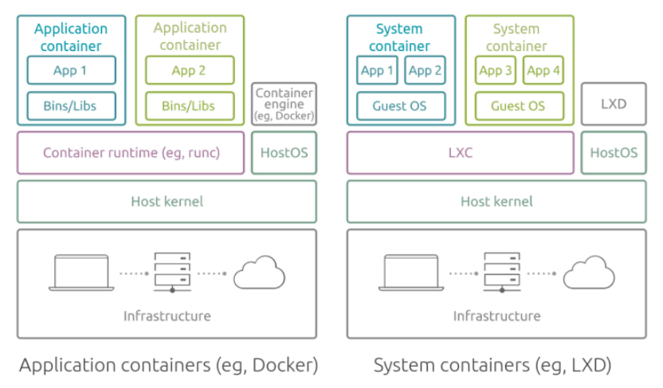

# Understanding containers

Sources:
- ✅ [LXD vs Docker](https://ubuntu.com/blog/lxd-vs-docker)

## TODO
https://www.redhat.com/en/topics/containers?sc_cid=70160000000x4xDAAQ

Benefits:
-offering speed, flexibility, and isolation from the underlying system

## What types of containers are there?
- **System containers** (as run by LXD) are similar to virtual or physical machines. They **run a full operating system inside them**, you can run any type of workload, and you manage them exactly as you would a virtual or a physical machine. System containers are usually **long-lasting** and you could host **several applications** within a single system container.
- **Application containers** (such as Docker), also known as process containers, are containers that **package and run a single process or a service** per container. They run **stateless types of workloads** that are meant to be ephemeral. This means that these containers are temporary, and you can create, delete and replace containers easily as needed.

> A common confusion for potential users of LXD is that LXD is an alternative to Docker or Kubernetes. However, LXD and Docker are not competing container technologies, and they tend to serve completely different purposes.

<!-- Source: https://ubuntu.com/blog/lxd-vs-docker -->

Both application and system containers share a kernel with the host operating system and utilize it to create isolated processes.
- Application containers run a single app/process.
- System containers run a full operating system giving them flexibility for the workload types they support.

## Docker vs Linux Containers
- https://earthly.dev/blog/lxc-vs-docker/
- https://www.upguard.com/blog/docker-vs-lxc
- https://ubuntu.com/blog/lxd-vs-docker
- https://www.redswitches.com/blog/lxc-vs-docker/
- https://www.section.io/engineering-education/lxc-vs-docker-what-is-the-difference-and-why-docker-is-better/

LXD utilises LXC for running system containers. LXC is the technology allowing the segmentation of your system into independent containers, whereas LXD is a daemon running on top of it allowing you to manage and operate these instances in an easy and unified way. When it comes to storage, networking, and logging, LXD supports a variety of interfaces and features that the user can control and interact with. LXD is image-based and you can utilise it to run any kind of workload, including traditional systems you would otherwise run in physical or virtual machines. Overall, functionality-wise, LXD is similar to VMWare or KVM hypervisors, but is much lighter on resources and removes the usual virtualization overhead.

Docker is a containerisation platform, it can be installed on a machine (workstation or a server) and provides a variety of tools for developing and operating containers. One of those tools is containerd – a daemon-based runtime that manages the complete lifecycle of Docker containers, including overall running and monitoring of containers. Docker abstracts away storage, networking, and logging, making it easy for developers that don’t have much prior Linux knowledge. Docker was specifically designed for microservice architecture, providing a way to decompose and isolate individual processes, which can then be scaled independently from the rest of the application or system they are a part of. 

> Up to version 0.8, Docker was essentially based on LXC.